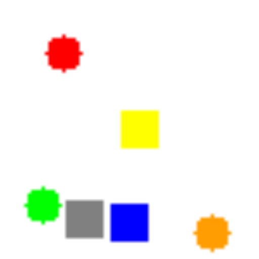

# relationships-from-entity-stream

Research idea, extending the work in the DeepMind "Relation Networks" paper : [A simple neural network module for relational reasoning](https://arxiv.org/pdf/1706.01427.pdf).

### Abstract

>    Relational reasoning is a central component of intelligent behavior, 
>    but has proven difficult for neural networks to learn.  The Relation Network (RN) 
>    module was recently proposed by DeepMind to solve such problems, 
>    and demonstrated state-of-the-art results on a number of datasets.  However, 
>    the RN module scales quadratically in the size of the input, 
>    since it calculates relationship factors between every patch in the visual field, 
>    including those that do not correspond to entities.  In this paper, 
>    we describe an architecture that enables relationships to be determined 
>    from a stream of entities obtained by an attention mechanism over the input field.  The model 
>    is trained end-to-end, and demonstrates 
>    equivalent performance with greater interpretability 
>    while requiring only a fraction of the model parameters of the original RN module.  

## Code Credits

The basic implementation here was derived from [kimhc6028/relational-networks](/kimhc6028/relational-networks), which 
credits [@gngdb](https://github.com/gngdb) for speeding up the model by 10 times.

The implementation of the "Relationship from Entity Stream" is the bulk of the new code here, and
the Sort-of-CLEVR generator has also been cleaned up (and extended, though that code wasn't used in the results submitted).

## Sort-of-CLEVR

Sort-of-CLEVR is simplified version of [CLEVR](http://cs.stanford.edu/people/jcjohns/clevr/).  This is composed of 10000 images and 20 questions (10 relational questions and 10 non-relational questions) per each image. 6 colors (red, green, blue, orange, gray, yellow) are assigned to randomly chosen shape (square or circle), and placed in a image.

Non-relational questions are composed of 3 subtypes:

1) Shape of certain colored object
2) Horizontal location of certain colored object : whether it is on the left side of the image or right side of the image
3) Vertical location of certain colored object : whether it is on the upside of the image or downside of the image

Theses questions are "non-relational" because the agent only need to focus on certain object.

Relational questions are composed of 3 subtypes:

1) Shape of the object which is closest to the certain colored object
1) Shape of the object which is furthest to the certain colored object
3) Number of objects which have the same shape with the certain colored object

These questions are "relational" because the agent has to consider the relations between objects.

Questions are encoded into a vector of size of 11 : 6 for one-hot vector for certain color among 6 colors, 2 for one-hot vector of relational/non-relational questions. 3 for one-hot vector of 3 subtypes.

i.e. : With the sample image shown, we can generate non-relational questions like:

1) What is the shape of the red object? => Circle (even though it does not really look like "circle"...)
2) Is green object placed on the left side of the image? => yes
3) Is orange object placed on the upside of the image? => no

And relational questions:

1) What is the shape of the object closest to the red object? => square
2) What is the shape of the object furthest to the orange object? => circle
3) How many objects have same shape with the blue object? => 3

## Requirements

- Python 2.7
- [numpy](http://www.numpy.org/)
- [pytorch](http://pytorch.org/)
- [opencv](http://opencv.org/)

----------

# Under Construction ...

THE FOLLOWING SECTION ARE CURRENTLY **UNDER CONSTRUCTION**, since the aim is to make the results of the NIPS ViGIL Workshop paper fully 
reproducible in a turn-key fashion.  The code in the repo on the submission date produced the RN, RFS and RFSH results 
cleanly - and I'm still trying to find the run that produced the (not particularly relevant) CNN scores.  Plus
also tidy up the code and instructions before the Workshop itself.

----------

## Usage 

	$ ./run.sh

or

  	$ python sort_of_clevr_generator.py

to generate sort-of-clevr dataset
and

 	 $ python main.py 

to train.

## Modifications

In the original paper, Sort-of-CLEVR task used different model from CLEVR task. However, 
because model used CLEVR requires much less time to compute (network is much smaller), 
this model is used for Sort-of-CLEVR task.

## Results

<!--
| | Relational Networks (20th epoch) | CNN + MLP (without RN, 100th epoch) |
| --- | --- | --- |
| Non-relational question | 99% | 66% |
| Relational question | 89% | 66% |
!-->

|     | Non-relational questions | Relational questions |
| | --- | --- | --- |
| Relational Networks (50th epoch)    | 99% | 94% |
| CNN + MLP (without RN, 100th epoch) | | |
| Rels from Ent Stream (RFS) 'soft'   | | |
| Rels from Ent Stream (RFS) 'hard'   | | |

CNN + MLP occured overfitting to the training data (result may also be seed dependent)

Relational networks shows far better results in relational questions and non-relation questions. 

